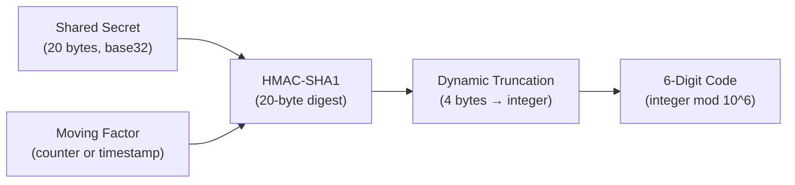
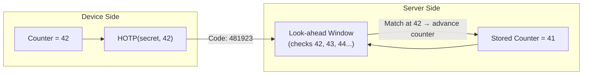
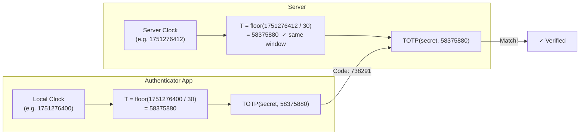
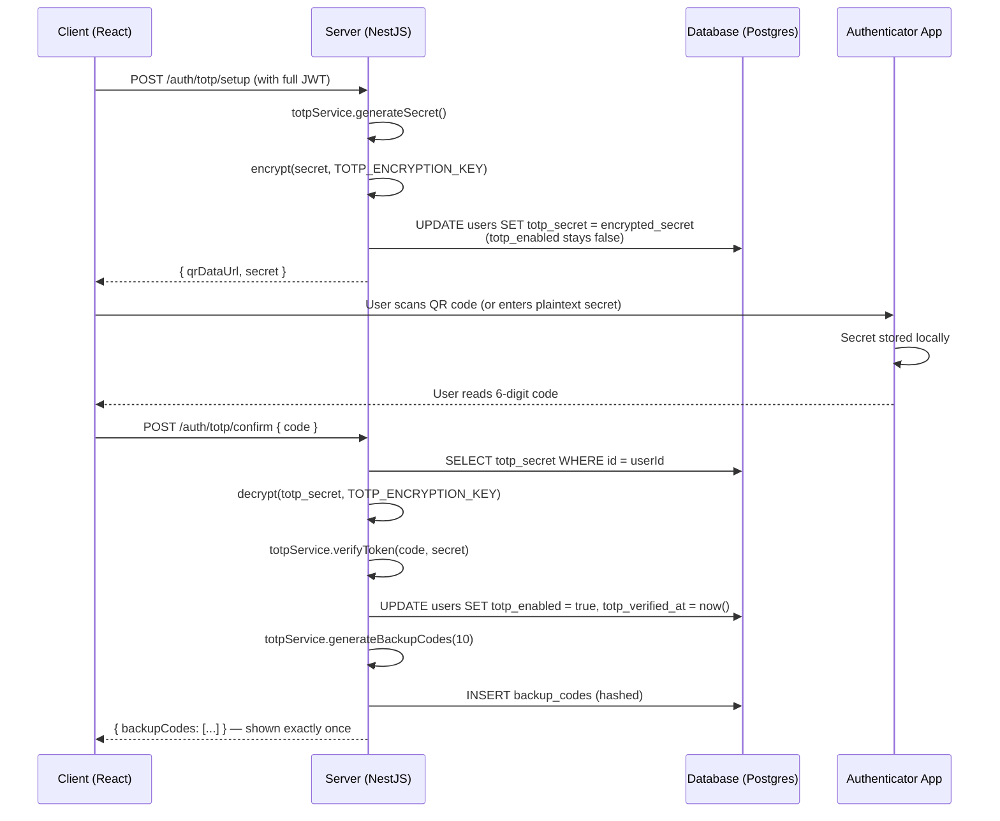
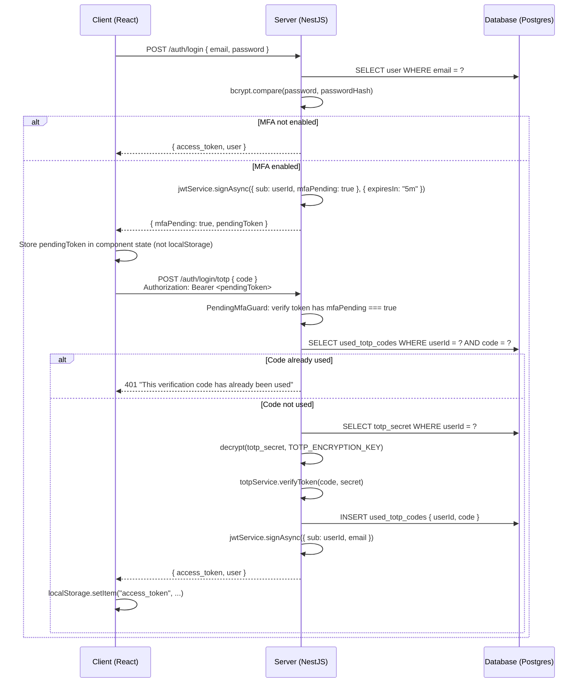

# TOTP Authentication: How It Works and How We Built It

*A ground-up explanation of OTP, HOTP, and TOTP — with a full walkthrough of a production NestJS + React implementation.*

---

## Table of Contents

1. [Why Passwords Alone Aren't Enough](#1-why-passwords-alone-arent-enough)
2. [OTP: The Umbrella Concept](#2-otp-the-umbrella-concept)
3. [HOTP: Counter-Based OTP](#3-hotp-counter-based-otp)
4. [TOTP: Time-Based OTP](#4-totp-time-based-otp)
5. [OTP / HOTP / TOTP at a Glance](#5-otp--hotp--totp-at-a-glance)
6. [The Setup Flow](#6-the-setup-flow)
7. [The Login Flow](#7-the-login-flow)
8. [How This Repo Implements It](#8-how-this-repo-implements-it)
    - [Secret Generation and Encryption](#81-secret-generation-and-encryption)
    - [QR Code Delivery](#82-qr-code-delivery)
    - [Verification](#83-verification)
    - [Replay Prevention](#84-replay-prevention)
    - [Backup Codes](#85-backup-codes)
    - [Rate Limiting](#86-rate-limiting)
    - [The Two JWT States](#87-the-two-jwt-states)
9. [Security Considerations](#9-security-considerations)
10. [Tradeoffs and What to Watch Out For](#10-tradeoffs-and-what-to-watch-out-for)
11. [Implementation Reference](#11-implementation-reference)

---

## 1. Why Passwords Alone Aren't Enough

Passwords are a single point of failure. They get phished, reused across services, leaked in breaches, or guessed from weak entropy. The credential-stuffing economy is real: billions of username/password pairs circulate on paste sites, and automated tools try them against every login form they can find.

The standard mitigation is a second factor — something the user *has* rather than something they *know*. If an attacker steals your password but cannot produce a valid one-time code from the device in your pocket, they're stuck.

TOTP (Time-based One-Time Password) is the mechanism behind Google Authenticator, Authy, 1Password TOTP, and virtually every "scan this QR code with your authenticator app" workflow. It's an open standard (RFC 6238), requires no network call at verification time, and generates codes that expire in 30 seconds. This post explains how it works from first principles, then walks through how we implemented it.

---

## 2. OTP: The Umbrella Concept

Before getting to TOTP specifically, it's worth understanding the general OTP mechanism that both HOTP and TOTP are built on top of. All OTP schemes share the same basic structure:

1. **A shared secret** — a random byte sequence (typically 20 bytes, encoded as base32) that both the server and the authenticator app know. It is generated once during setup and never transmitted again.
2. **A moving factor** — an input that changes with each code so the same secret never produces the same code twice.
3. **HMAC-SHA1** — the shared secret and moving factor are combined with HMAC-SHA1 to produce a 20-byte digest.
4. **Dynamic truncation** — a 4-byte slice is extracted from the digest based on the value of the last nibble, then converted to a 6-digit decimal number by taking it modulo 10⁶.

The diagram below shows this pipeline:



The output is deterministic given the same inputs. The server computes the same pipeline independently — there is no code being *sent* from the authenticator to the server for comparison; both sides arrive at the same number by running the same algorithm over the same secret and the same moving factor.

The critical insight is that the shared secret never leaves either side after setup. What travels over the network during authentication is only the short numeric code — and that code is valid for a single use within a brief window.

---

## 3. HOTP: Counter-Based OTP

HOTP (HMAC-based One-Time Password, RFC 4226) uses a **monotonically incrementing counter** as the moving factor. Every time the user generates a code, the counter on the authenticator device increments by one. When the server verifies the code, it increments its own counter.

The problem this creates is drift: if the user generates several codes without submitting them (hitting "next code" repeatedly on a hardware token, for example), the device's counter gets ahead of the server's counter. To handle this, servers implement a **look-ahead window** — they will check not just the current counter value, but also the next *N* values. If a match is found at position *k* ahead, the server advances its stored counter to *k* and accepts the code.



Once the server finds a match and advances its counter, that same code can never match again because the server will only accept counters *greater* than the one it just accepted. Replay prevention is implicit in the counter mechanics.

HOTP is most common in hardware tokens (like RSA SecurID or FIDO counters) where pressing a physical button generates and increments. For web authentication, where the user is already on a networked device, the clock-based variant is far more practical.

---

## 4. TOTP: Time-Based OTP

TOTP (RFC 6238) replaces the HOTP counter with a **time step**: the number of 30-second intervals elapsed since the Unix epoch.

```
T = floor(current_unix_timestamp / 30)
```

Both the device and the server compute `T` independently from their local clocks. Because they are computing the same value — provided their clocks are roughly synchronized — they arrive at the same 6-digit code without any communication. The code changes every 30 seconds and is the same on every correctly configured device sharing that secret.



The server tolerates a small amount of clock skew by checking adjacent time windows (typically ±1 step, so ±30 seconds). This handles the common case where the user reads the code in the last few seconds of its validity and the server's clock is slightly ahead or behind.

Because each time step produces a different code, a captured code is useless after its 30-second window expires. For codes that are used *within* their window, TOTP doesn't automatically prevent replay the way HOTP's counter does — a captured valid code could theoretically be replayed within the same window. We'll cover how this implementation addresses that below.

---

## 5. OTP / HOTP / TOTP at a Glance

| Aspect | OTP (general) | HOTP | TOTP |
|---|---|---|---|
| **Moving factor** | Any changing input | Incrementing counter | `floor(unix_time / 30)` |
| **Needs clock sync** | — | No | Yes (rough, ±seconds) |
| **Resync after drift** | — | Yes (look-ahead window required) | No (each window is independent) |
| **Code lifetime** | — | Until the next code is generated | ~30 seconds |
| **Common use case** | — | Hardware tokens, push buttons | Authenticator apps (Google, Authy, 1Password) |
| **Network call to verify** | — | No | No |
| **Replay vulnerability** | — | No (counter advances on match) | Yes within the window — must track used codes |
| **This repo's window tolerance** | — | N/A | ±1 step (±30 s), via otplib default |

The replay vulnerability row is the one most implementations get wrong. TOTP's expiry is *temporal*, not *use-based* — a code is valid for its window regardless of how many times it's been submitted. Explicit used-code tracking is required to close that gap.

---

## 6. The Setup Flow

TOTP setup needs to get a shared secret from the server to the authenticator app without transmitting it in a way that an observer could record and replay. The standard mechanism is a QR code encoding an `otpauth://` URI, which the app scans and stores locally.

The sequence below shows the exact setup flow in this implementation:



Two things worth noting in this sequence: the secret is encrypted *before* being written to the database, even during the setup phase before `totp_enabled` is flipped to `true`. And the backup codes are returned in plaintext exactly once — after that, only their bcrypt hashes exist anywhere in the system.

---

## 7. The Login Flow

Once TOTP is enabled on an account, login becomes a two-step process. The first step verifies the password; the second verifies the TOTP code. These steps are deliberately isolated: the first step issues a short-lived *pending* JWT that can only be used to complete step two, not to access any protected resources.



The `pendingToken` is stored in React component state, not `localStorage`. This matters: `localStorage` persists across tabs and sessions, which is the wrong behavior for a transient auth token that should be consumed immediately. The pending token also expires in 5 minutes, after which completing step two requires restarting step one.

---

## 8. How This Repo Implements It

### 8.1 Secret Generation and Encryption

Secret generation is handled by `TotpService`, which wraps `otplib` v13 with its pure-JS, zero-native-dependency plugins:

```typescript
// backend/src/auth/totp.service.ts
import { TOTP, NobleCryptoPlugin, ScureBase32Plugin } from 'otplib';

constructor() {
  this.totp = new TOTP({
    crypto: new NobleCryptoPlugin(),   // @noble/hashes for HMAC
    base32: new ScureBase32Plugin(),   // @scure/base for base32 encoding
  });
}

generateSecret(): string {
  return this.totp.generateSecret(); // 20-byte random → base32
}
```

`NobleCryptoPlugin` and `ScureBase32Plugin` replace the standard Node.js `crypto` and a native base32 library with audited, pure-TypeScript implementations. The generated secret is a standard 20-character base32 string compatible with any RFC 6238 authenticator app.

Before the secret is written to the database, it is encrypted using AES-256-CBC:

```typescript
// backend/src/common/utils/encrypt.ts
export function encrypt(text: string, keyHex: string): string {
  const key = Buffer.from(keyHex, 'hex');     // 32-byte key from hex string
  const iv = crypto.randomBytes(16);           // fresh IV for every encryption
  const cipher = crypto.createCipheriv('aes-256-cbc', key, iv);

  let encrypted = cipher.update(text, 'utf8', 'hex');
  encrypted += cipher.final('hex');

  return `${iv.toString('hex')}:${encrypted}`; // stored as "iv:ciphertext"
}
```

Each encryption uses a fresh 16-byte IV, so the same plaintext secret produces a different ciphertext every time. The key is a 32-byte value provided via the `TOTP_ENCRYPTION_KEY` environment variable as a 64-character hex string. The `encrypt` function validates this length and throws if it's wrong rather than silently using a truncated or zero-padded key.

This is the call site in `AuthService`:

```typescript
// backend/src/auth/auth.service.ts — inside setupTotp()
const secret = this.totpService.generateSecret();
const key = this.configService.get<string>('TOTP_ENCRYPTION_KEY', '');
const encryptedSecret = encrypt(secret, key);

await this.db
  .update(schema.users)
  .set({ totpSecret: encryptedSecret })
  .where(eq(schema.users.id, userId));
```

The plaintext secret is never stored. Decryption happens inline at verification time, held in a local variable, and discarded immediately after use.

### 8.2 QR Code Delivery

After generating and encrypting the secret, the server constructs an `otpauth://` URI via `totp.toURI()` and renders it into a base64 PNG data URL using the `qrcode` package:

```typescript
// backend/src/auth/totp.service.ts
async generateQrDataUrl(email: string, secret: string): Promise<string> {
  const otpauthUrl = this.totp.toURI({
    label: email,
    issuer: this.appName, // 'SECURE_AUTH'
    secret,
  });
  return qrcode.toDataURL(otpauthUrl); // base64 PNG data URL
}
```

The data URL is returned directly to the client and rendered as an `` tag — no separate file is written to disk, no URL that could be bookmarked or crawled. The plaintext secret is also returned as a fallback for users who can't scan a QR code and need to enter it manually.

The `setup` endpoint is protected by `JwtAuthGuard`, which explicitly rejects tokens carrying `mfaPending: true`. This means you cannot re-initiate setup using a pending token from a partially completed login.

### 8.3 Verification

The verification function wraps `otplib`'s async `verify` with a try/catch to normalize all error types to a boolean:

```typescript
// backend/src/auth/totp.service.ts
async verifyToken(token: string, secret: string): Promise<boolean> {
  try {
    const result = await this.totp.verify(token, { secret });
    return !!result.valid;
  } catch {
    return false;
  }
}
```

`otplib`'s default tolerance is ±1 time step, meaning it accepts codes from the previous window, the current window, and the next window. This accommodates up to 30 seconds of clock skew in either direction. The tolerance is not customized here — ±1 is the RFC-recommended value and matches what Google Authenticator expects.

### 8.4 Replay Prevention

TOTP codes are valid for their entire time window regardless of how many times they're submitted. Without additional tracking, the same valid code could be submitted twice within a 30-second window and both requests would succeed.

The implementation prevents this with a `used_totp_codes` table:

```typescript
// backend/src/auth/auth.service.ts — inside loginStep2()

// 1. Check before verifying
const recentCodes = await this.db
  .select()
  .from(schema.usedTotpCodes)
  .where(
    and(
      eq(schema.usedTotpCodes.userId, userId),
      eq(schema.usedTotpCodes.code, totpCode),
    ),
  )
  .limit(1);

if (recentCodes.length > 0) {
  throw new UnauthorizedException('This verification code has already been used');
}

// 2. Verify, then record
const isValid = await this.totpService.verifyToken(totpCode, secret);
if (!isValid) { throw new UnauthorizedException('Invalid verification code'); }

await this.db.insert(schema.usedTotpCodes).values({ userId, code: totpCode });
```

The `used_totp_codes` table has a composite index on `(userId, code)`, making the lookup a fast index scan rather than a full table scan.

Codes older than 90 seconds are pruned by a cron job that runs every minute:

```typescript
// backend/src/auth/auth.service.ts
@Cron(CronExpression.EVERY_MINUTE)
async cleanUsedTotpCodes() {
  const ninetySecondsAgo = new Date(Date.now() - 90 * 1000);
  await this.db
    .delete(schema.usedTotpCodes)
    .where(lt(schema.usedTotpCodes.usedAt, ninetySecondsAgo));
}
```

The 90-second cutoff is deliberate: with a ±1 step tolerance, the oldest window a valid code could come from is the previous 30-second window — so any code more than 90 seconds old is guaranteed to be expired and safe to delete. This bounds the size of the table to at most a few hundred rows in steady-state operation.

### 8.5 Backup Codes

Backup codes are generated at `confirmTotp` time — the moment TOTP is first activated — and returned to the client exactly once in plaintext. The server only ever stores their bcrypt hashes.

The generation function uses `crypto.randomBytes` with rejection sampling to avoid modulo bias:

```typescript
// backend/src/auth/totp.service.ts
generateBackupCodes(count = 10): string[] {
  const chars = 'ABCDEFGHIJKLMNOPQRSTUVWXYZabcdefghijklmnopqrstuvwxyz0123456789';
  const charsLen = chars.length;                 // 62
  const maxUnbiased = 256 - (256 % charsLen);    // 248 = largest multiple of 62 ≤ 256

  const codes: string[] = [];
  for (let i = 0; i < count; i++) {
    let code = '';
    while (code.length < 8) {
      const byte = randomBytes(1)[0];
      if (byte < maxUnbiased) {
        code += chars[byte % charsLen];
      }
      // Bytes in [248, 255] are discarded — no bias.
    }
    codes.push(code);
  }
  return codes;
}
```

**Why rejection sampling matters here:** with 62 characters in the alphabet, `byte % 62` maps the range [0, 255] non-uniformly — values 0–61 have a slightly higher probability than 62–123, and so on, because 256 is not evenly divisible by 62. The bias is small (about 0.8% per character) but measurable across all 8 characters of a code. Discarding bytes above 247 (the largest multiple of 62 below 256) ensures a perfectly uniform distribution.

Each backup code is then stored as a bcrypt hash:

```typescript
// backend/src/auth/auth.service.ts — inside confirmTotp()
const backupCodesToInsert = plainBackupCodes.map((code) => {
  const salt = bcrypt.genSaltSync(10);
  const codeHash = bcrypt.hashSync(code, salt);
  return { userId, codeHash, used: false };
});
await this.db.insert(schema.backupCodes).values(backupCodesToInsert);
```

When a backup code is submitted at login, the server fetches all unused hashes for that user and compares each one using `bcrypt.compare`. This is a linear scan (O(n) where n = remaining backup codes, at most 10), but given the small size this is acceptable. Once a code matches, it's marked `used = true` in the database — it cannot be used again.

### 8.6 Rate Limiting

Two throttling profiles are applied using `@nestjs/throttler`:

| Endpoint | Limit | Window |
|---|---|---|
| `POST /auth/login/totp` | 5 attempts | 15 minutes |
| `POST /auth/totp/backup` | 5 attempts | 15 minutes |
| `POST /auth/totp/confirm` | 10 attempts | 1 hour |

```typescript
// backend/src/auth/auth.controller.ts
@Post('login/totp')
@UseGuards(PendingMfaGuard, ThrottlerGuard)
@Throttle({ loginTotp: { limit: 5, ttl: 900000 } })
async loginTotp(@Req() req: Request, @Body() verifyTotpDto: VerifyTotpDto) { ... }
```

The limits are applied per-IP by default. For `login/totp` and `totp/backup`, 5 attempts per 15 minutes limits brute force against the 6-digit space (10⁶ possibilities) while still allowing for human error. The `confirm` endpoint is more lenient (10 attempts per hour) because it's only reached during the deliberate setup flow with a known-correct secret.

### 8.7 The Two JWT States

The implementation uses a single JWT secret for two structurally different tokens. The difference is a single field in the payload:

| Token type | `mfaPending` field | Can access |
|---|---|---|
| Full access token | absent | All routes protected by `JwtAuthGuard` |
| Pending MFA token | `true`, expires in 5 min | Only `POST /auth/login/totp` and `POST /auth/totp/backup` |

`JwtAuthGuard` explicitly rejects tokens where `mfaPending === true`:

```typescript
// backend/src/auth/guards/jwt-auth.guard.ts
const payload = await this.jwtService.verifyAsync<Record<string, unknown>>(token);
if (payload.mfaPending === true) {
  throw new UnauthorizedException('Multi-factor authentication required');
}
```

`PendingMfaGuard` does the inverse — it rejects tokens where `mfaPending` is absent or false:

```typescript
// backend/src/auth/guards/pending-mfa.guard.ts
const payload = await this.jwtService.verifyAsync<Record<string, unknown>>(token);
if (payload.mfaPending !== true) {
  throw new UnauthorizedException('MFA is not pending or token is fully authorized');
}
```

This means a fully authenticated user cannot accidentally call the TOTP verification endpoint, and a user in the pending state cannot access protected resources. The two guards are mutually exclusive by design.

---

## 9. Security Considerations

### Why encrypt the secret at rest?

TOTP secrets are long-lived — they don't rotate until the user explicitly disables and re-enables MFA. If an attacker gains read access to the database (a SQL injection, a backup leak, a misconfigured replica), unencrypted secrets would immediately expose every user's second factor. With AES-256-CBC encryption, database access alone is insufficient — the attacker also needs the `TOTP_ENCRYPTION_KEY`, which is an environment variable that should never be in the database or version-controlled configuration. This is defense in depth, not a substitute for preventing database compromise.

### Why track used codes rather than relying on window expiry?

A TOTP code is valid for up to 90 seconds (the current window ± one adjacent window). Without tracking, two requests using the same code within that window would both succeed. This matters in practice when an attacker can observe valid codes — for example, via shoulder-surfing, keyloggers, or a compromised endpoint. Tracking used codes reduces the effective window for replay from 90 seconds to zero.

### Why bcrypt backup codes?

Backup codes are credentials. If someone gains read access to the database, unhashed backup codes immediately provide login access to any account whose user hasn't used them yet. Bcrypt hashing ensures that a database read is insufficient for authentication, at the cost of a slightly more expensive comparison (O(n) bcrypt comparisons at verification time, where n ≤ 10).

### What about the ±1 window tolerance?

The ±1 step tolerance (±30 seconds) is the RFC 6238 recommendation and is what most TOTP clients expect. Tightening it to ±0 would break usability for users whose device clocks drift slightly; widening it past ±1 extends the validity window without meaningful security benefit for a web authentication scenario. The combination of ±1 tolerance + used-code tracking gives the best of both: usability without replay risk.

### Clock skew at scale

TOTP shifts the clock synchronization burden to the client device. For most users this is a solved problem (NTP, GPS, carrier time sync). The edge case to watch is users who intentionally set their clock forward or backward, or devices in airplane mode that drift. The ±1 step tolerance covers typical real-world drift; significant drift (more than a minute) will cause legitimate codes to fail, and the user's only recourse is to correct their device clock or use a backup code.

---

## 10. Tradeoffs and What to Watch Out For

**What this implementation does well:**

- Secret encryption at rest with a per-encryption IV (no ECB-mode pitfalls)
- Explicit replay prevention with automatic cleanup via cron
- Two distinct JWT states enforced by complementary guards — it's not possible to accidentally cross them
- Cryptographically secure backup code generation with rejection sampling
- Backup codes are hashed with bcrypt and shown exactly once

**What to watch for as the system grows:**

- **Horizontal scaling**: The `cleanUsedTotpCodes` cron runs on every NestJS instance. In a multi-instance deployment, all instances will compete to delete the same rows, which is harmless (the deletes are idempotent) but wasteful. A distributed lock or a dedicated background worker is worth adding before scaling beyond one instance.

- **Key rotation**: `TOTP_ENCRYPTION_KEY` has no rotation mechanism. Adding support for key versioning (encrypt with the new key, decrypt by trying both) is necessary if you ever need to rotate the key without forcing all users to re-enroll.

- **Backup code exhaustion**: When all 10 backup codes are used, the user has no fallback if they lose their authenticator device. The current UI doesn't surface remaining backup code count. Surfacing this — and prompting to generate new codes — prevents users from unknowingly running out.

- **Account recovery**: There is no account recovery flow for users who lose both their authenticator app and their backup codes. This is a deliberate omission (recovery flows are a common social-engineering attack vector), but it's something to decide on explicitly before shipping.

---

## 11. Implementation Reference

For readers who want to explore the source directly:

| File | Purpose |
|---|---|
| [backend/src/auth/totp.service.ts](https://github.com/nelsonfrank/mfa/blob/main/backend/src/auth/totp.service.ts) | Secret generation, QR code creation, token verification, backup code generation |
| [backend/src/auth/auth.service.ts](https://github.com/nelsonfrank/mfa/blob/main/backend/src/auth/auth.service.ts) | All TOTP-related business logic: setup, confirm, login step 2, disable, backup code verification, cron cleanup |
| [backend/src/auth/auth.controller.ts](https://github.com/nelsonfrank/mfa/blob/main/backend/src/auth/auth.controller.ts) | HTTP endpoints, guard wiring, and throttler annotations |
| [backend/src/auth/guards/jwt-auth.guard.ts](https://github.com/nelsonfrank/mfa/blob/main/backend/src/auth/guards/jwt-auth.guard.ts) | Rejects pending-MFA tokens from fully authenticated routes |
| [backend/src/auth/guards/pending-mfa.guard.ts](https://github.com/nelsonfrank/mfa/blob/main/backend/src/auth/guards/pending-mfa.guard.ts) | Accepts only pending-MFA tokens on TOTP verification routes |
| [backend/src/common/utils/encrypt.ts](https://github.com/nelsonfrank/mfa/blob/main/backend/src/common/utils/encrypt.ts) | AES-256-CBC encrypt/decrypt utilities |
| [backend/src/database/schema.ts](https://github.com/nelsonfrank/mfa/blob/main/backend/src/database/schema.ts) | `users`, `used_totp_codes`, and `backup_codes` table definitions (Drizzle ORM) |
| [backend/src/auth/auth.module.ts](https://github.com/nelsonfrank/mfa/blob/main/backend/src/auth/auth.module.ts) | NestJS module configuration, JWT settings, throttler profiles |
| [backend/src/auth/dto/totp.dto.ts](https://github.com/nelsonfrank/mfa/blob/main/backend/src/auth/dto/totp.dto.ts) | Input validation — 6-digit numeric TOTP codes, 8-character backup codes |
| [client/src/routes/security.tsx](https://github.com/nelsonfrank/mfa/blob/main/client/src/routes/security.tsx) | TOTP setup UI: QR display, manual secret, confirmation, backup code reveal |
| [client/src/routes/login.tsx](https://github.com/nelsonfrank/mfa/blob/main/client/src/routes/login.tsx) | Two-step login UI: credentials → TOTP challenge → backup code fallback |
| [client/src/lib/api.ts](https://github.com/nelsonfrank/mfa/blob/main/client/src/lib/api.ts) | Client-side API functions for all TOTP endpoints |

**Key dependencies:**

| Package | Version | Role |
|---|---|---|
| `otplib` | `^13.4.1` | TOTP generation and verification (RFC 6238) |
| `qrcode` | `^1.5.4` | `otpauth://` URI → base64 PNG QR code |
| `bcryptjs` | `^3.0.3` | Password hashing and backup code hashing |
| `@nestjs/throttler` | `^6.5.0` | Rate limiting on TOTP verification endpoints |
| `@nestjs/jwt` | `^11.0.2` | JWT signing and verification (both token states) |
| `drizzle-orm` | `^0.45.2` | Type-safe Postgres ORM |
